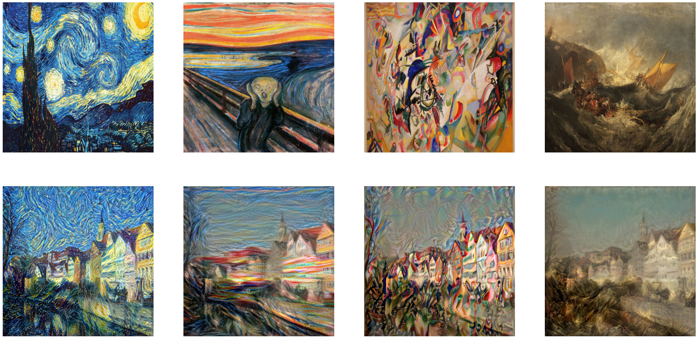

# Image Style Transfer Using Convolutional Neural Networks
## Introduction
* This is Image Style Transfer Using Convolutional Neural Networks implementation repository
## Requirement
    python == 3.8
    tensorflow == 2.8.0
## Run
* Running style_transfer.py
    ```
  python style_transfer --style_img --content_img
    ```
* args
  * style_img : style image path
  * content_img : content image path
* You can modify content weights(alpha), style weights(beta) and num_iteration at configs/Config.py
## Result
  * content image   

  * transfer result   

## Reference
  * Image Style Transfer Using Convolutional Neural Networks. Leon A. Gatys, Alexander S. Ecker, Matthias Bethge
  * [Keras Neural Style Transfer example code](https://keras.io/examples/generative/neural_style_transfer/)